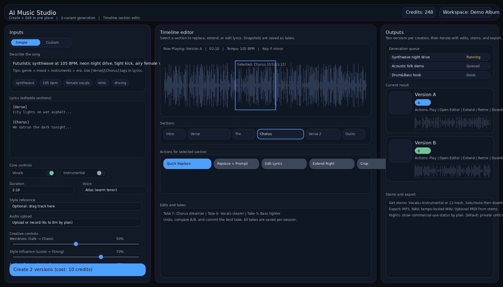

# AI Music Studio - Web Frontend Plan

## Concept Design



---

## Executive Summary

This document outlines the plan for building a web-based frontend for HeartLib music generation. The interface is designed as a professional "AI Music Studio" that enables users to create, edit, and export AI-generated music with fine-grained control over the generation process.

**Key Features:**
- Text-to-music generation with style tags and lyrics
- Timeline-based editing with section selection
- A/B version comparison
- Generation queue management
- Stems separation and export

---

## 1. Architecture Overview

```
┌─────────────────────────────────────────────────────────────────┐
│                      AI Music Studio                             │
├─────────────────────────────────────────────────────────────────┤
│                                                                  │
│  ┌──────────────┐    ┌──────────────┐    ┌──────────────┐       │
│  │   Frontend   │    │   Backend    │    │   HeartLib   │       │
│  │  (React/TS)  │◄──►│  (FastAPI)   │◄──►│   (PyTorch)  │       │
│  └──────────────┘    └──────────────┘    └──────────────┘       │
│        │                    │                    │               │
│        ▼                    ▼                    ▼               │
│  - Vite + React        - REST API          - HeartMuLa 3B       │
│  - Tailwind CSS        - WebSocket         - HeartCodec         │
│  - shadcn/ui           - Job Queue         - Flow Matching      │
│  - Wavesurfer.js       - SQLite            - GB10 Optimized     │
│                                                                  │
└─────────────────────────────────────────────────────────────────┘
```

---

## 2. UI Components Breakdown

### 2.1 Left Panel: Inputs

| Component | Type | Description |
|-----------|------|-------------|
| Mode Toggle | Tab | Simple / Custom mode switch |
| Song Description | Textarea | Main prompt for generation |
| Style Tags | Tag Input | Genre, BPM, mood, instruments, era |
| Lyrics Editor | Textarea | Editable sections with [Verse]/[Chorus] markers |
| Vocals Toggle | Switch | Enable/disable vocals |
| Instrumental Toggle | Switch | Enable/disable instrumental |
| Duration | Input | Song length (e.g., "2:10") |
| Voice Selector | Dropdown | Voice model selection (e.g., "Atlas (warm tenor)") |
| Style Reference | File Drop | Optional reference track upload |
| Audio Upload | File Input | Upload audio for processing |
| Temperature | Range | Sampling temperature (0.1-2.0, default 1.0) |
| Top-K | Range | Vocabulary restriction (1-100, default 50) |
| CFG Scale | Range | Classifier-free guidance (1.0-3.0, default 1.5) |
| Flow Steps | Range | 5-20 steps (quality vs speed tradeoff) |
| Create Button | Button | "Create 2 versions" |

### 2.2 Center Panel: Timeline Editor

| Component | Type | Description |
|-----------|------|-------------|
| Now Playing | Display | Current version, duration, tempo, key |
| Waveform | Canvas | Interactive waveform with selection |
| Section Tabs | Tab Bar | Intro, Verse, Pre, Chorus, Verse 2, Outro |
| Quick Replace | Button | Replace selected section |
| Replace + Prompt | Button | Replace with new prompt |
| Edit Lyrics | Button | Modify lyrics for section |
| Extend Right | Button | Extend song from selection |
| Crop | Button | Trim to selection |
| Edits/Takes | List | History of takes with descriptions |

### 2.3 Right Panel: Outputs

| Component | Type | Description |
|-----------|------|-------------|
| Generation Queue | List | Jobs with status (Running, Queued, Done) |
| Version A | Card | Waveform preview + actions |
| Version B | Card | Waveform preview + actions |
| Actions | Buttons | Play, Open Editor, Extend, Remix, Download |
| Stems Export | Panel | Vocals+Instrumental or 12-track separation |
| Export Formats | Options | MP3, WAV, tempo-locked WAV, MIDI |
| Rights Info | Display | Commercial-use status by plan |

---

## 3. Backend API Design

### 3.1 Core Endpoints

```
POST   /api/generate              # Start new generation job
GET    /api/jobs/{job_id}         # Get job status
GET    /api/jobs/{job_id}/audio   # Download generated audio
DELETE /api/jobs/{job_id}         # Cancel job

POST   /api/edit/replace          # Replace section
POST   /api/edit/extend           # Extend from position
POST   /api/edit/crop             # Crop audio

GET    /api/stems/{job_id}        # Get separated stems
GET    /api/export/{job_id}       # Export in format

WS     /ws/jobs                   # Real-time job updates
```

### 3.2 Generation Request Schema

```json
{
  "prompt": "Futuristic synthwave at 105 BPM...",
  "tags": ["synthwave", "105 bpm", "female vocals", "retro"],
  "lyrics": {
    "verse": "City lights on wet asphalt...",
    "chorus": "We outrun the dark tonight..."
  },
  "settings": {
    "vocals": true,
    "instrumental": false,
    "duration": "2:10",
    "voice": "atlas_warm_tenor",
    "temperature": 1.0,
    "topk": 50,
    "cfg_scale": 1.5,
    "flow_steps": 10,
    "num_versions": 2
  },
  "reference_audio": null,
  "seed": 42
}
```

### 3.3 Job Status Response

```json
{
  "job_id": "abc123",
  "status": "running",
  "progress": 0.45,
  "eta_seconds": 30,
  "versions": [
    {
      "id": "v1",
      "status": "complete",
      "audio_url": "/api/jobs/abc123/audio?version=v1",
      "waveform_data": [...],
      "duration": 130.5,
      "tempo": 105,
      "key": "F minor"
    }
  ]
}
```

---

## 4. Technology Stack

### 4.1 Frontend

| Technology | Purpose |
|------------|---------|
| React 18 | UI framework |
| TypeScript | Type safety |
| Vite | Build tool |
| Tailwind CSS | Styling |
| shadcn/ui | Component library |
| Wavesurfer.js | Waveform visualization |
| Zustand | State management |
| React Query | API data fetching |
| Socket.io-client | WebSocket for real-time updates |

### 4.2 Backend

| Technology | Purpose |
|------------|---------|
| FastAPI | REST API framework |
| SQLite | Job queue and metadata storage |
| Celery + Redis | Background job processing |
| WebSockets | Real-time progress updates |
| HeartLib | Music generation engine |

---

## 5. Implementation Phases

### Phase 1: Basic Generation UI
- [ ] Set up React app with Vite + Tailwind + shadcn/ui
- [ ] Implement left panel inputs (prompt, tags, basic controls)
- [ ] Create FastAPI backend with /generate endpoint
- [ ] Connect frontend to HeartLib pipeline
- [ ] Basic audio playback

### Phase 2: Timeline Editor
- [ ] Integrate Wavesurfer.js for waveform display
- [ ] Implement section selection
- [ ] Add section tabs (Intro, Verse, Chorus, etc.)
- [ ] Section-based editing actions

### Phase 3: Version Comparison
- [ ] A/B version generation
- [ ] Side-by-side comparison UI
- [ ] Version selection and commit

### Phase 4: Generation Queue
- [ ] Job queue backend with Celery
- [ ] WebSocket progress updates
- [ ] Queue management UI

### Phase 5: Export & Stems
- [ ] Audio export in multiple formats
- [ ] Stems separation (if supported)
- [ ] Download management

### Phase 6: Polish

- [ ] Workspace management
- [ ] User preferences
- [ ] Mobile responsiveness

---

## 6. Folder Structure

```
heartlib-gb10/
├── docs/
│   ├── GB10_OPTIMIZATION_PLAN.md
│   ├── ADVANCED_OPTIMIZATION_RESEARCH.md
│   └── WEB_FRONTEND_PLAN.md
├── src/
│   └── heartlib/           # Existing HeartLib code
├── web/
│   ├── frontend/           # React app
│   │   ├── src/
│   │   │   ├── components/
│   │   │   │   ├── inputs/
│   │   │   │   ├── timeline/
│   │   │   │   └── outputs/
│   │   │   ├── hooks/
│   │   │   ├── stores/
│   │   │   └── App.tsx
│   │   ├── package.json
│   │   └── vite.config.ts
│   └── backend/            # FastAPI app
│       ├── app/
│       │   ├── main.py
│       │   ├── routes/
│       │   ├── services/
│       │   └── models/
│       └── pyproject.toml
└── scripts/
    └── benchmark.py
```

---

## 7. Key Technical Considerations

### 7.1 Real-time Progress

Music generation takes 30-60+ seconds. Users need feedback:
- WebSocket connection for live progress
- Progress bar with ETA
- Waveform preview as generation progresses (if possible)

### 7.2 Audio Handling

- Use Web Audio API for playback
- Wavesurfer.js for visualization
- Support for seeking, looping, A/B comparison
- Efficient streaming for large files

### 7.3 State Management

- Generation jobs: server-side (SQLite + Celery)
- UI state: Zustand (lightweight, simple)
- API cache: React Query (automatic refetching, caching)

### 7.4 Performance

- Lazy load waveform data
- Virtualize long lists (queue, takes)
- Debounce slider inputs
- Optimize re-renders with React.memo

---

## 8. Research: Similar Products

### 8.1 Suno AI
- Text-to-music with lyrics
- Style tags and genre selection
- Version comparison
- Extend/remix features

### 8.2 Udio
- High-quality generation
- Fine-grained control
- Stems separation
- Professional export options

### 8.3 Key Differentiators for AI Music Studio
- **Local/self-hosted**: Runs on user's GB10 hardware
- **No usage limits**: No credits needed (or optional)
- **Full control**: All parameters exposed (including flow steps)
- **Open source**: Customizable and extensible

---

## 9. Open Questions

1. **Authentication**: Do we need user accounts, or is this single-user?
2. **Storage**: Where to store generated audio? Local filesystem or cloud?
3. **Stems**: Does HeartLib support stems separation, or is this a future feature?
4. **Voice models**: What voice options are available in HeartMuLa?

---

## 10. Next Steps

1. Review this plan and provide feedback
2. Decide on Phase 1 scope
3. Set up frontend scaffolding in `web/frontend/`
4. Set up backend scaffolding in `web/backend/`
5. Implement basic generation flow end-to-end

---

*Document Version: 1.0*
*Last Updated: 2026-01-20*
*Concept Design: Provided by user*
